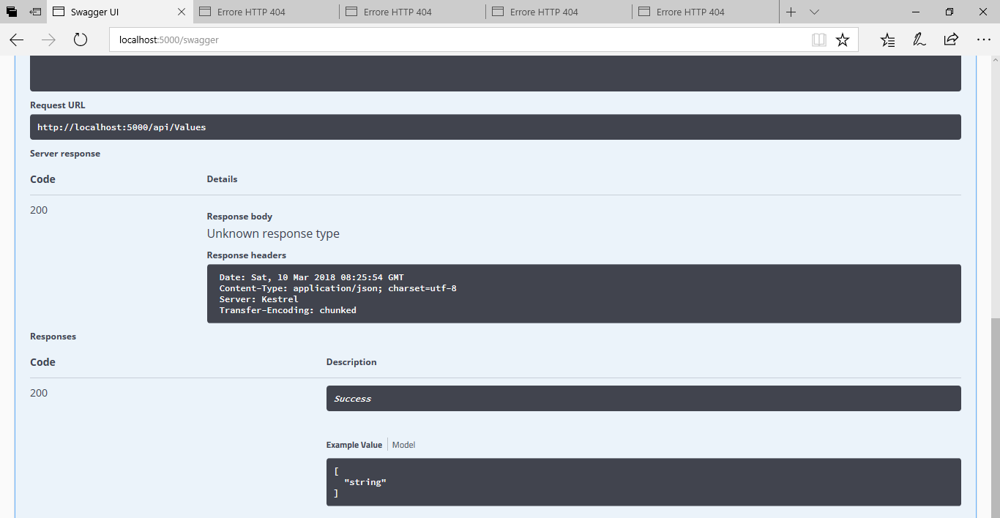

# Swashbuckle-Issue-631-Repro

Unknown error response when consuming GET /api/values from Microsoft Edge.



Using ASP.NET Core SDK v2.0.3 but all of these are installed in my system, included the v2.1 preview1.

* 1.0.0 [C:\Program Files\dotnet\sdk]
* 1.0.1 [C:\Program Files\dotnet\sdk]
* 1.0.4 [C:\Program Files\dotnet\sdk]
* 1.1.0 [C:\Program Files\dotnet\sdk]
* 2.0.0 [C:\Program Files\dotnet\sdk]
* 2.0.0-preview1-005977 [C:\Program Files\dotnet\sdk]
* 2.0.2 [C:\Program Files\dotnet\sdk]
* 2.0.3 [C:\Program Files\dotnet\sdk]
* **2.1.300-preview1-008174 [C:\Program Files\dotnet\sdk]**

Here's the raw response Kestrel is returning. Please note it's **chuncked**, that's why those 13 and 0 appear.
```
HTTP/1.1 200 OK
Date: Sat, 10 Mar 2018 08:48:27 GMT
Content-Type: application/json; charset=utf-8
Server: Kestrel
Transfer-Encoding: chunked

13
["value1","value2"]
0

```

Fiddler correctly detects this and offers to decode the response.

